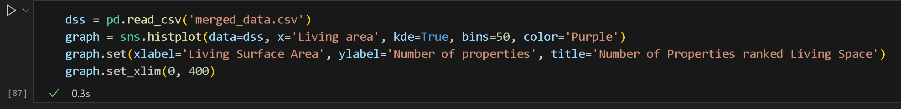
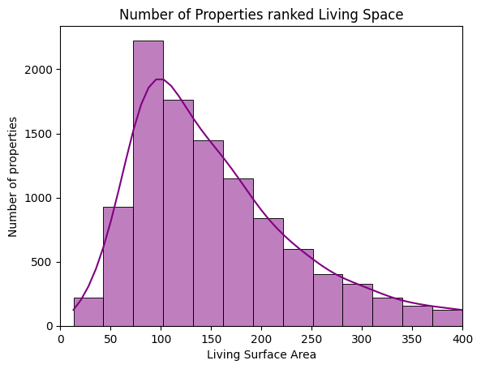

# Immo Project Data Analysis

A 5 day study project to understand Plotting and Data Visualization.

## About

This was made as the second part of a four part study project at Becode Ghent, where the aim was to get to know and familiarize ourselves with plotting, data visualizations and making correlatinos between multiple Data entries.

The two csv files are used to compare before and after cleanup from our original dataset.

First part of the project: [our Data Scraper.]('https://github.com/danielbauwens/challenge-collecting-data')

## Installation (and Requirements)

 

Open the Jupyter Notebook file (.ipynb).

For required packages you can use 'pip install -m requirements.txt' in your terminal to get everything.
## Usage

There's nothing very complex, so you can do everything after you've installed the requirements file from within the notebook. 
Simply remember to run the code blocks in descending order, so you get the correct packages initialized.

## Timeline

This was completed over the course of 5 (work)days, from the 5th of Juli to the 11th of Juli.µ

## Future Improvements/Additions

- More accuracy with Data Correlations by having a bigger dataset.
- Can try for wider choice of plots to use (map locations, area charts, ...)
- Better usage of color to highlight specific values

## Related

Here are some related projects:

- [Zipcode/City Data scraper I made for this project](https://github.com/matiassingers/awesome-readme)
- [First part of this project: Dataset used here.](https://github.com/matiassingers/awesome-readme)

## About me

You can find more of my work here;

- [Daniel's LinkedIn](https://www.linkedin.com/in/daniel-bauwens-5515a8256/)
- [Daniel's GitHub](https://github.com/danielbauwens)