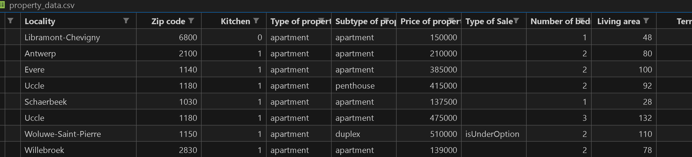
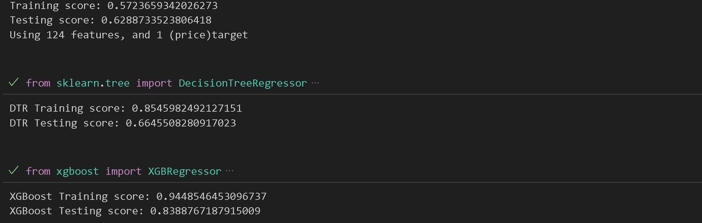
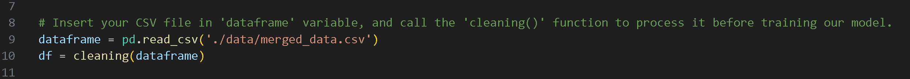

# ImmoWeb Data Analysis and Prediction Models

A multi-week project combining our skills with plotting, analyzing and regression models.

## About the project

This repository includes work done over 2 different projects that will be concluded with a final price predictor project (yet to be added). It consists of Data processing and machine learning with said Data to make target prediction.

### 1️⃣ Data Scraper (Part One) 

Pilot project: [our Data Scraper.](https://github.com/danielbauwens/challenge-collecting-data)
The very first project, which can be found in its own repository. 

### 2️⃣ Data Analysis (Part Two) 

This was made as the second part of a four part study project, where the aim was to get to know and familiarize ourselves with plotting, data visualizations and making correlatinos between multiple Data entries.

### 3️⃣ Data Modelling (Part Three) 

This was made as the third part of the study project. The main goal is to understand how to use our datasets with regression machine learning models to predict accurate target values(whatever that may be) based on the inputted features. All the while making sure not to overfit the model to the data at hand.

### 4️⃣ Data Prediction (Part Four/Conclusion) 
To be completed.

## Installation, Requirements and Usage 🛄

 

*The two notebooks include the initial graphing results from part one, and the pipeline used to get the scores from LinearRegression, XGBoost, DecisionTree and RandomForest models. The SRC folder's 'main.py' displays all of the above regressors' scores when run.*

For required packages you can use 'pip install -m requirements.txt' in your terminal to get all the required packages.

Run the 'main.py' file with the correctly processed dataset (variable names that match those included in the original 'merged_data.csv' file). Put your dataset in the '/data' directory and link to it with the correct name in the 'dataframe' variable.

To run the file, navigate to the /SRC directory in your terminal and type 'python3 main.py' to start and run the program.

## Timeline 🕙

**Part One(*Data Analysis*)** was completed over the course of 5 (work)days, from the 5th of Juli to the 11th of Juli.

**Part Two(*Data Modelling*)** was completed over the course of 4 days, from the 17th of Juli to the 20th of Juli.

## Future Improvements/Additions 🔜

### Data Analysis Improvements:
- Improve correlation accuracy by using a larger dataset.
- Try for different plots to use (map locations, area charts, ...)
- Better usage of color to highlight specific values

### Data Modelling Improvements:
- Explore different regression models to improve score.
- More (Hyper)Parameter Tuning.
- Larger dataset = Better training.
- Cleaner datasets/more pre-processing.

## Related 🛃

Here are related projects, made by me:

- [Zipcode/City Data scraper I made for this project](https://github.com/danielbauwens/Data-Scraper-Belgian-Locations)
- [First part of this project: I'm using the dataset taken from here.](https://github.com/danielbauwens/challenge-collecting-data)

## About me 🛂

You can find more of my work here;

- [Daniel's LinkedIn](https://www.linkedin.com/in/daniel-bauwens-5515a8256/)
- [Daniel's GitHub](https://github.com/danielbauwens)