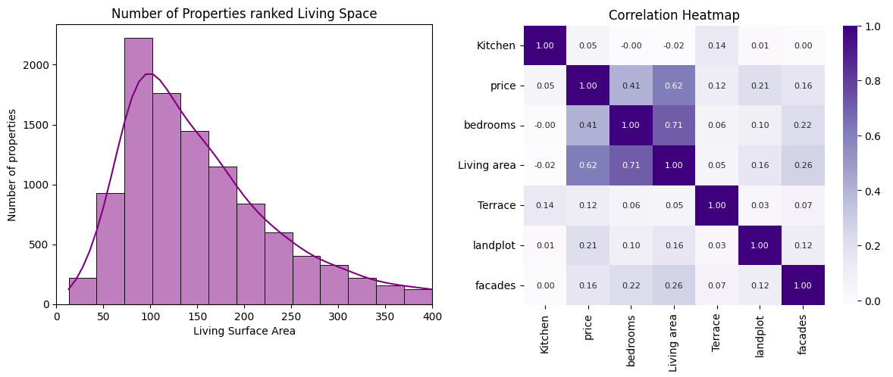
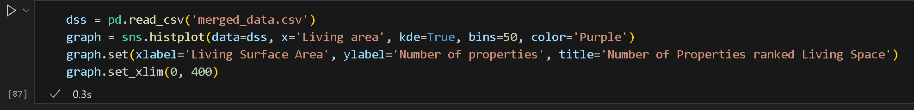

# ImmoWeb Data Analysis and Prediction Models

A multi-week project combining our skills with plotting, analyzing and regression models.

## Data Analysis (Part One)

This was made as the second part of a four part study project at BeCode Ghent, where the aim was to get to know and familiarize ourselves with plotting, data visualizations and making correlatinos between multiple Data entries.

The two csv files are used to compare before and after cleanup from our original dataset.

First part of the project: [our Data Scraper.](https://github.com/danielbauwens/challenge-collecting-data)

### Data Analysis Usage

There's nothing very complex, so you can do everything after you've installed the requirements file from within the notebook. 
Simply remember to run the code blocks in descending order, so you get the correct packages initialized.

## Data Modelling (Part Two)

This was made as the third part of our study project at BeCode Ghent. The main goal is to understand how to use our datasets with regression machine learning models to predict accurate target values(whatever that may be) based on the inputted features. All the while making sure not to overfit the model to the data at hand.

## Installation (and Requirements)

 

*The two notebooks include the initial graphing results from part one, and the pipeline used to get the scores from LinearRegression, XGBoost, DecisionTree and RandomForest models. The SRC folder only uses the LinearRegressor*

For required packages you can use 'pip install -m requirements.txt' in your terminal to get everything.

## Timeline 

**Part One(*Data Analysis*)** was completed over the course of 5 (work)days, from the 5th of Juli to the 11th of Juli.

**Part Two(*Data Modelling*)** was completed over the course of 4 days, from the 17th of Juli to the 20th of Juli.

## Future Improvements/Additions

### Data Analysis Improvements:
- More accuracy with Data Correlations by having a bigger dataset.
- Can try for wider choice of plots to use (map locations, area charts, ...)
- Better usage of color to highlight specific values

### Data Modelling Improvements:
- Explore different regression models.
- More Parameter Tuning.
- Bigger datasets.
- Cleaner datasets/more pre-processing.

## Related

Here are some related projects by me:

- [Zipcode/City Data scraper I made for this project](https://github.com/danielbauwens/Data-Scraper-Belgian-Locations)
- [First part of this project: Dataset used here.](https://github.com/danielbauwens/challenge-collecting-data)

## About me

You can find more of my work here;

- [Daniel's LinkedIn](https://www.linkedin.com/in/daniel-bauwens-5515a8256/)
- [Daniel's GitHub](https://github.com/danielbauwens)